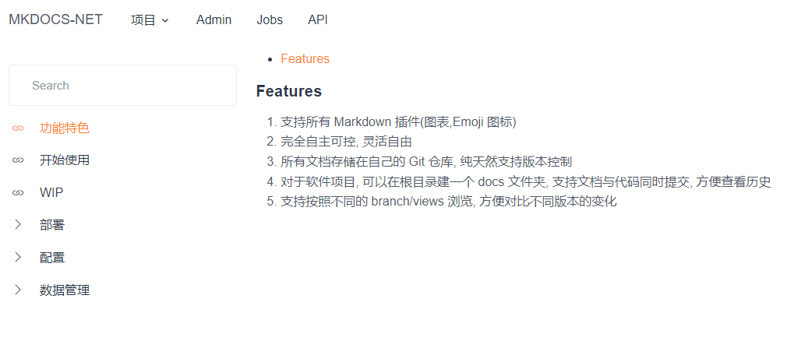

# mkdocs-net

使用 Docker 构建你自己的 Markdown 静态网站，支持 Gogs, GitLab 等私有 git 服务器[(English Introduction)](./README.md)

## 功能

- 使用 Docker 构建你自己的 Markdown 静态网站
- 实时与私有 git 服务器同步更新
- 支持 Gogs, GitLab 等私有 git 服务器
- SSR输出,对SEO友好

[](https://drone.feinian.net/feinian/mkdocs-net)

Git Repository: [GitHub](https://github.com/dukecheng/mkdocs-net) [Feinian's Git](https://git.feinian.net/feinian/mkdocs-net)

[查看官网](https://mkdocs.feinian.net)




## 使用云

<https://mkdocs.feinian.net>

## 独立部署

use follow docker run script to host your own mkdocs website

## Deploy

```bash
docker run -d -it --name mkdocs -p 6363:80 \
-v /data/mkdocs:/app_data \
--restart=always \
hub.feinian.net/feinian/mkdocs_net:latest
```

## Update

```bash
docker pull hub.feinian.net/feinian/mkdocs_net:latest && \
docker stop mkdocs && \
docker rm mkdocs && \
docker run -d -it --name mkdocs -p 6363:8080 \
-v /data/mkdocs:/app_data \
--restart=always \
hub.feinian.net/feinian/mkdocs_net:latest
```
